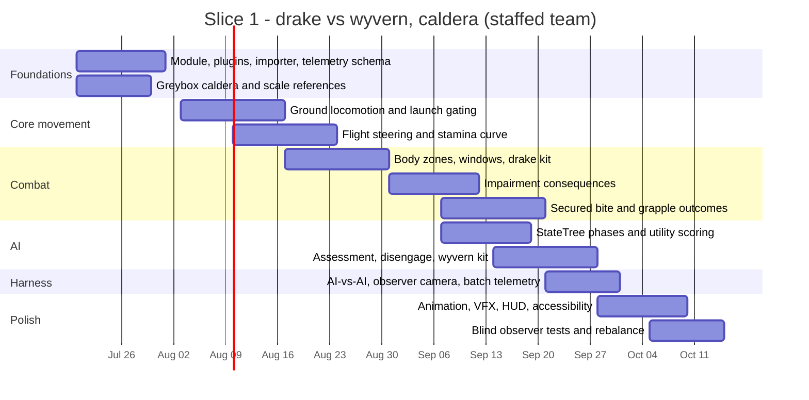

# Prototype plan

The research proposes a 12-week prototype: three species, two maps, a solo
gauntlet, and an AI-vs-AI observer mode. The phase *order* is right and is
adopted below. The duration is not achievable at every team size, and this
document says so plainly rather than letting the schedule fail quietly.

## What 12 weeks assumes

Twelve weeks to three morphotypes with flight, grapple, body-part
consequence, assessment AI, and two maps assumes a staffed team: at minimum a
gameplay engineer, an animator, a technical animator or rigger, and a
designer, with purchased or kitbashed animation. It assumes rigs and proxy
animation are *bought*, not authored.

Honest ranges for the same scope:

| Team | Realistic duration to slice 1 (drake vs wyvern, caldera) |
|---|---|
| 4-person staffed team, purchased animation | 10–14 weeks |
| 2 people, one of them full-time on animation | 5–7 months |
| Solo, agent-assisted, purchased animation | 9–15 months |

Slice 1 is drake vs wyvern in the caldera. The longneck, the forest map, and
the legacy cycle are slice 2 and beyond. Anyone planning against the 12-week
figure should first decide which row they are in.

## What slips first, and in what order

When the schedule compresses — and it will — cut in this order. This list
exists so the decision is made now, calmly, rather than in week nine.

1. **Presentation polish.** VFX quality, audio layering, HUD art.
2. **The gauntlet mode.** The encounter is the product; the wrapper is not.
3. **Breath weapons.** Contact combat proves the thesis; breath is a second system.
4. **The third morphotype.** Two body plans already prove differentiation.
5. **Grapple outcome variety.** Three outcomes can become two without losing the pillar.

Never cut, in any compression scenario:

- telemetry and the AI-vs-AI harness — without them you cannot tell whether
  the cuts broke the design;
- body-part consequence — it is the reason this project exists;
- stamina performance degradation before zero;
- the assessment model — it is what makes the opponent read as an animal.

If the cut list reaches the "never cut" section, the project needs a smaller
slice, not a longer schedule.

## Phase order

| Phase | Weeks (staffed) | Contents | Gate |
|---|---|---|---|
| 0 Foundations | 1–2 | Module compiles, plugins, telemetry schema, JSON→DataAsset importer, greybox caldera | Data validates; a pawn spawns and logs a combat event |
| 1 Core movement | 2–5 | Ground locomotion, launch gating, flight steering, stamina curve, camera | Gate A |
| 2 Contact combat | 4–7 | Body zones, attack windows, drake kit, brace, hit validation | Gate B |
| 3 Consequence | 6–8 | Wing asymmetry, limb impairment, jaw and neck effects, forced landing | Gate C |
| 4 Grappling | 7–9 | Contact validation, secured bite, rotational follow-up, three outcomes | Gate D |
| 5 Assessment AI | 7–10 | StateTree phases, utility scoring, assessment and disengage, wyvern kit | Gate E |
| 6 Harness | 9–10 | AI-vs-AI mode, observer camera, batch runs, falsification thresholds | All F-thresholds measurable |
| 7 Presentation | 10–12 | Animation pass, VFX, HUD, accessibility, performance | Gate F |

Phases overlap. Phase 6 is deliberately early — it is a measuring
instrument, and an instrument built after the thing it measures is finished
tends to confirm whatever was built.

## The 12-week Gantt, adjusted

## Open production variables

Unresolved and treated as variables, not assumptions: final art style,
target platforms and hardware tiers, team size, budget, monetisation, and
whether this stays single-player. None of them block slice 1. All of them
should be recorded in `DECISIONS.md` before slice 2 scope is set.
